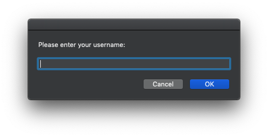
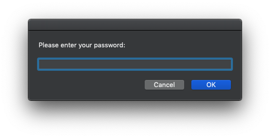

# AppleScript Network Drive Utility
This utility was created for users to be able to mount network drives from their MacOS devices with input prompts that will appear asking for credidentials. 

This is a very simple solution for users to connect to network drives via SMB connections. 

Below script will check if *"Data"* drive exists before mounting. 

```AppleScript
-- Gathering user credidentials
set username to (display dialog "Please enter your Username:" default answer "")
set user to the text returned of username

set userpass to display dialog "Please enter your Password:" default answer "" with hidden answer
set pass to the text returned of userpass

-- Start the 'Mounting' drive process
if not (disk "Data" exists) then
	mount volume "smb://[LOCATION TO SERVER DRIVE]/Data" as user name user with password pass
	display notification "G Drive Successfully Mounted" with title "Drive Utility"
else
	display notification "G Drive has already been mounted." with title "Drive Utility"
end if
```

## Application Preview

*Username Prompt*

*Password Prompt*

*Notification Banner*


